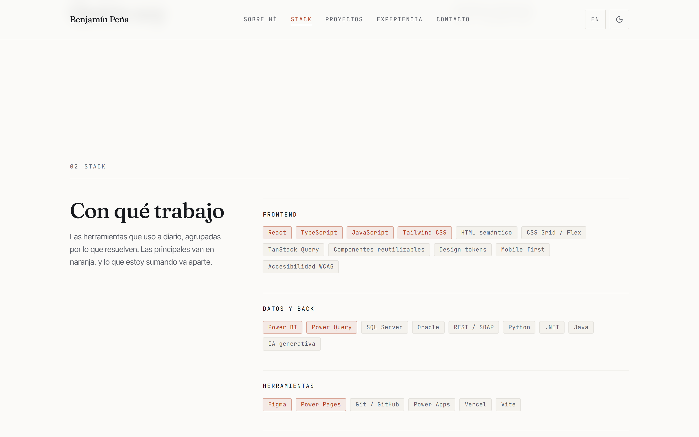
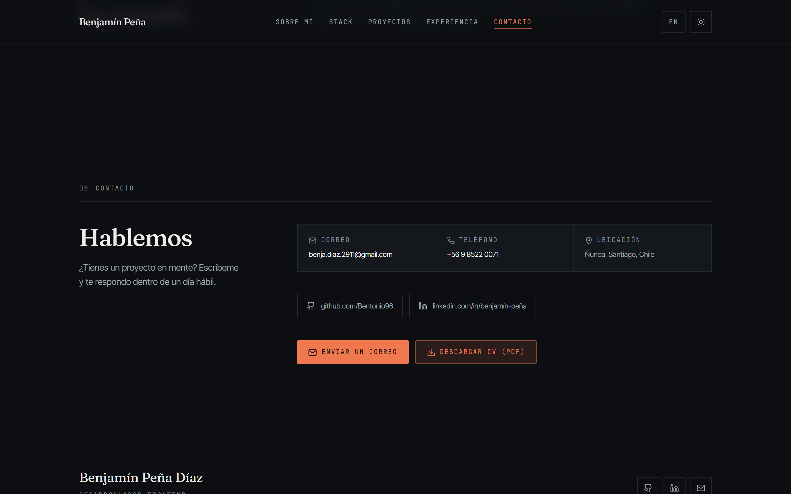

# Portafolio · Benjamín Peña Díaz

Sitio personal de **Benjamín Peña Díaz**, desarrollador frontend en Santiago de Chile.
Español en `/`, inglés en `/en`, modo claro y oscuro, y todo el contenido en archivos de datos tipados.

**Lighthouse en producción:** 100 / 100 / 100 / 100 en escritorio · 96 / 100 / 100 / 100 en móvil
**Accesibilidad:** 0 violaciones de axe-core (WCAG 2.1 AA) en las 5 pantallas auditadas


---

## Índice

- [Cómo agregar un proyecto](#cómo-agregar-un-proyecto) ← lo que vas a hacer más seguido
- [Puesta en marcha](#puesta-en-marcha)
- [Capturas](#capturas)
- [Stack](#stack)
- [Decisiones de diseño](#decisiones-de-diseño)
- [Decisiones técnicas](#decisiones-técnicas)
- [Estructura](#estructura)
- [Deploy en Vercel](#deploy-en-vercel)
- [Pendientes para Benjamín](#pendientes-para-benjamín)

---

## Cómo agregar un proyecto

Se edita **un solo archivo**: [`src/data/proyectos.ts`](src/data/proyectos.ts).
Nada más. La grilla, la numeración, las animaciones y los enlaces se ajustan solos.

```ts
{
  slug: "epicentro",                     // identificador único, sin espacios
  nombre: "Epicentro",
  descripcion: {
    es: "Rastreador de sismos en Chile en tiempo casi real con datos del USGS.",
    en: "Near real-time earthquake tracker for Chile using USGS data.",
  },
  tecnologias: ["Next.js 15", "TypeScript", "Tailwind CSS", "MapLibre"],
  anio: "2026",
  demoUrl: "https://epicentro-sigma.vercel.app",         // ← opcional
  repoUrl: "https://github.com/Bentonio96/Epicentro",    // ← opcional
}
```

### Sobre los dos enlaces

`demoUrl` y `repoUrl` son **opcionales a propósito**:

| Situación | Qué se muestra |
|---|---|
| Ambas URLs | Botones **Ver sitio** y **Ver código** |
| Solo `repoUrl` | Solo **Ver código** |
| Solo `demoUrl` | Solo **Ver sitio** |
| Ninguna | Ningún botón, y la tarjeta se cierra limpia sin dejar hueco |

**Nunca se renderiza un enlace roto.** Mientras no tengas una URL, deja la propiedad comentada o bórrala — no pongas `""` ni `"#"`.

El tipo `Proyecto` está en [`src/types/index.ts`](src/types/index.ts), así que si te falta un campo obligatorio TypeScript te avisa antes de compilar.

### Resaltar una tecnología del stack

En [`src/data/stack.ts`](src/data/stack.ts), `principal: true` pinta la tecnología con el color de acento:

```ts
{ nombre: "React", principal: true },   // en naranja
{ nombre: "HTML semántico" },           // en neutro
```

Úsalo con moderación: hoy son 8 de 34. El resalte funciona porque es minoría.

Para lectores de pantalla el chip añade "— herramienta principal", porque el criterio WCAG 1.4.1 no permite transmitir información solo con color.

---

## Puesta en marcha

```bash
npm install
```

```bash
npm run dev
```

| Comando | Qué hace |
|---|---|
| `npm run dev` | Servidor de desarrollo en http://localhost:3000 |
| `npm run build` | Build de producción |
| `npm start` | Sirve el build |
| `npm run lint` | ESLint |
| `npm run typecheck` | TypeScript sin emitir |

Regenerar imágenes (foto optimizada, favicons, Open Graph) después de cambiar la foto:

```bash
node scripts/generar-assets.mjs
```

Regenerar las miniaturas de los proyectos capturando sus sitios en vivo:

```bash
node scripts/capturar-proyectos.mjs
```

Verificar el contraste real, con el sitio corriendo en `localhost:3001`:

```bash
node scripts/verificar-contraste.mjs
```

---

## Capturas

| Claro | Oscuro |
|---|---|
|  |  |

**Sobre mí** — biografía, idiomas y certificaciones


**Stack** — las herramientas principales van en acento; el resto, en neutro



**Proyectos** — tarjetas con los dos enlaces, numeración editorial y chips de tecnología


**Experiencia** — línea de tiempo con el hito actual acentuado


**Inglés** (`/en`) — misma composición, `lang="en"`, hreflang cruzado


**Contacto** — el CTA de correo sólido, el CV en variante de acento



**Móvil** — 390 px, navegación en panel desplegable

| Claro | Oscuro |
|---|---|
|  |  |

---

## Stack

- **Next.js 15** con App Router
- **TypeScript** en modo estricto
- **Tailwind CSS v4** — los tokens viven en `@theme`, dentro de `src/app/globals.css`
- **lucide-react** para íconos
- **next/font** — Fraunces, Inter Tight y JetBrains Mono, autoalojadas
- **next/image** — AVIF y WebP automáticos
- Sin dependencias de runtime más allá de React, Next y lucide

---

## Decisiones de diseño

### Concepto: "Cordillera Editorial"

La idea era que no pareciera plantilla de portafolio. Tres reglas sostienen todo:

1. **Grilla editorial visible.** Secciones numeradas en monoespaciada (`01 — SOBRE MÍ`), reglas capilares de 1 px, columnas asimétricas donde el título queda fijo (`sticky`) mientras el contenido se desplaza. Se lee como algo compuesto, no como bloques apilados.

2. **Un solo acento, con disciplina.** El naranja quemado aparece en: el CTA primario, el botón de descarga del CV, las herramientas principales del stack, el indicador de sección activa del nav, el anillo de foco, el punto de "disponible", el hito actual de la línea de tiempo y el hover de enlaces. En ningún otro lugar, y todo lo demás vive en neutros.

   La disciplina está en la proporción, no en la lista: en el stack solo 8 de 34 tecnologías van en acento. Si se resaltara la mitad, el resalte dejaría de significar algo. Y hay tres pesos, no dos: relleno sólido para el CTA principal, borde y texto en acento sobre fondo teñido para lo importante-pero-secundario (el CV, los chips principales), y neutro para el resto.

3. **La foto como pieza, no como avatar.** Bloque 4:5 en escritorio con un marco de acento desplazado detrás que rompe la grilla; banda 4:3 en móvil. El cielo de la foto funciona como espacio negativo.

### Tipografía

| Rol | Fuente | Por qué |
|---|---|---|
| Titulares | **Fraunces** 400/500 | Serif de alto contraste con carácter propio, sin caer en decorativa |
| Cuerpo | **Inter Tight** 400 | Neutra y estrecha, aguanta bien párrafos largos |
| Etiquetas y chips | **JetBrains Mono** 400 | Da el tono técnico de los metadatos sin gritar |

Escala modular de 1.25, fluida con `clamp()` en los tamaños grandes.

### Color

Neutros fríos con un acento cálido. Todos los pares cumplen **WCAG AA** (verificado con axe-core, no a ojo):

| Token | Claro | Oscuro | Contraste |
|---|---|---|---|
| Fondo | `#FBFAF8` | `#0C0E12` | — |
| Texto | `#16181D` | `#EDEDEB` | 16.4:1 / 17.1:1 |
| Atenuado | `#5C6069` | `#9BA1AB` | 6.0:1 / 7.5:1 |
| Tenue | `#6A6E77` | `#878D98` | 4.9:1 / 5.4:1 |
| **Acento** | `#B04426` | `#F0784E` | 5.4:1 / 6.9:1 |

Los radios son de 2 px: casi rectos, editorial y no burbuja.

---

## Decisiones técnicas

### Un solo idioma por documento, sin librería de i18n

El sitio sirve español en `/` e inglés en `/en`, ambos **prerenderizados estáticos** y ambos indexables, con `hreflang` cruzado y los dos en el sitemap.

La estructura es un único root layout dentro de `src/app/[idioma]/`, que es lo que permite que `<html lang>` sea correcto en cada idioma sin renderizado dinámico. La raíz `/` sirve el español mediante un **rewrite** (no un redirect), así que el enlace del CV queda limpio y sin saltos.

No se usó `next-intl` ni similar: para dos idiomas y un diccionario plano, un `Record<Idioma, string>` tipado hace lo mismo con cero kilobytes de runtime.

### Vidrio y auras

Hay una inspiración lejana en el material translúcido de macOS Tahoe, pero deliberadamente parcial: aplicarlo entero habría borrado el carácter editorial del sitio, que se apoya justamente en ser plano y recto.

El criterio es que **la forma diga qué es cada cosa**. El contenido —tarjetas, reglas, secciones— sigue opaco y con radios de 2 px. Lo que flota y es pulsable —el encabezado, los controles de tema e idioma, el menú móvil— es vidrio translúcido y redondeado. Así el material comunica "esto es un control" en vez de ser decoración.

Tres detalles que hacen que el vidrio se lea como material y no como transparencia:

- **Saturación además de desenfoque.** Sin `backdrop-saturate`, el desenfoque apaga los colores de detrás y el resultado parece sucio.
- **Reflejo especular** en el canto superior (`box-shadow: inset 0 1px 0`), que es lo que da sensación de volumen.
- **Opacidad al 80 %**, no menos. Con el desenfoque aplicado sigue leyéndose como vidrio, y si el desenfoque falla en algún navegador el encabezado sigue siendo legible en vez de dejar el texto de la sección anterior chocando con el del nav.

### El contraste que las auditorías no ven

Las auras del fondo destaparon un punto ciego que vale la pena documentar: **axe no las detecta**. Calcula el fondo de un texto recorriendo sus ancestros, y las auras viven en una capa fija con `z-index` negativo que no es ancestro de nada. Se puede subir su intensidad, seguir viendo *0 violaciones* y aun así dejar texto por debajo de AA.

Pasó exactamente eso: con las auras centradas, axe daba 0 violaciones mientras el contraste real medido sobre los píxeles era de **4.46:1**. Por eso existe [`scripts/verificar-contraste.mjs`](scripts/verificar-contraste.mjs), que captura la pantalla, muestrea el color real justo encima de cada texto a lo largo de toda la página y sale con código 1 si algo baja de 4.5:1.

La solución fue anclar las auras a los bordes —con parte del círculo fuera de pantalla— para que el color se vea intenso en los márgenes y caiga antes de llegar a la columna de texto, y oscurecer un punto el token `--c-tenue`. Peor caso actual: 4.76:1 en claro, 5.40:1 en oscuro.

Sobre las auras hay además **paralaje**: la capa se desplaza unos píxeles en sentido contrario al puntero, lo que da sensación de profundidad. Se aplica como `transform` sobre la capa entera —no moviendo los centros de los gradientes— para que lo resuelva el compositor sin repintar el fondo, y el valor se escribe directo sobre el nodo con una ref, sin estado de React, para no disparar un render por evento. Se desactiva en pantallas táctiles y con `prefers-reduced-motion`.

A propósito **no** hay un halo que siga al cursor: pasaría por encima del texto y le bajaría el contraste justo donde se está leyendo. El paralaje mueve auras ancladas a los bordes, que nunca invaden la columna de texto.

Encima de todo va una capa de **grano**: un SVG de 160×160 con `feTurbulence`, embebido y repetido, al 3,5 % de opacidad (5 % en oscuro). Es lo que separa un degradado "de diseño" de una banda de color plana — rompe el bandeado y da textura. Va en su propia capa, quieta, porque un grano que se moviera con el paralaje delataría el truco.

El `<h1>` lleva un **degradado recortado al texto**, de la tinta al acento en diagonal. El punto más claro del recorrido es el propio acento (5.4:1 en claro, 6.9:1 en oscuro), muy por encima del 3:1 que pide AA para texto grande. Si el navegador no sabe hacer `background-clip: text`, cae al color sólido en vez de dejar el titular invisible.

Las **tarjetas de proyecto** tienen borde degradado: dos fondos superpuestos —el color de la superficie recortado a la caja de relleno y un degradado cónico recortado a la del borde— con el ángulo registrado vía `@property` para que el navegador sepa interpolarlo. Gira al pasar el cursor **y al recibir foco**, así que también aparece navegando con teclado.

Las **auras** son tres gradientes radiales fijos detrás del contenido. Ambos tonos salen del mismo acento —uno tal cual y otro girado hacia el ámbar— para no romper la regla de un solo color. Son gradientes de fondo y no un filtro de desenfoque, así que no cuestan recomposición. Viven en una capa con `z-index` negativo, lo que obliga a que el color de fondo esté en `<html>` y no en `<body>`.

### Lo que se mueve, y por qué

Cinco interacciones, todas respetando `prefers-reduced-motion` y ninguna a costa de las métricas:

- **Progreso de lectura.** Una barra de 3 px en el borde superior, con degradado del acento al ámbar. Va con `animation-timeline: scroll(root)`: sin JavaScript, sin escuchas de scroll y fuera del hilo principal. Es decorativa —no aporta nada que la barra de desplazamiento no diga ya— así que se oculta a lectores de pantalla.


- **Miniaturas de proyecto.** Cada tarjeta muestra una captura del sitio real, generada por [`scripts/capturar-proyectos.mjs`](scripts/capturar-proyectos.mjs) desde la demo en producción, así que no se desactualizan a mano. Se ven siempre, no al pasar el cursor: esconder la captura tras un hover dejaría fuera a quien entra desde un teléfono, y es justo lo que alguien quiere ver antes de decidir si abre el proyecto. Lo que reacciona es un acercamiento discreto. Las tres cargan en diferido — la sección queda bajo el pliegue en todos los tamaños, así que precargarlas solo le quitaría ancho de banda a la foto del hero, que sí es el elemento LCP.

- **Cruce entre Stack y Proyectos.** Apuntar una tecnología del stack resalta los proyectos que la usan; apuntar o **enfocar** un proyecto resalta sus tecnologías en el stack. "React" y "React 19" se reconocen como la misma cosa. El resalte suma un anillo de acento en vez de atenuar el resto: bajar la opacidad de lo no coincidente reduciría el contraste del texto. Es una mejora progresiva — la relación ya está escrita en la página, cada tarjeta lista sus tecnologías — así que no añade paradas de tabulación, y quien navega con teclado igual obtiene la dirección proyecto → stack vía foco.

- **Transición de tema.** El tema nuevo se abre en círculo desde el propio botón, con la View Transitions API. Sin soporte o con movimiento reducido, cambia al instante.

- **Línea de tiempo que se llena.** La regla vertical de Experiencia se rellena en acento a medida que bajas, con animaciones ligadas al scroll de CSS: cero JavaScript y fuera del hilo principal. Donde no hay soporte, queda la regla gris de base.

### Animaciones en CSS, no en JavaScript

Las apariciones al hacer scroll son transiciones CSS de `transform` controladas por un `IntersectionObserver` propio ([`src/components/ui/Reveal.tsx`](src/components/ui/Reveal.tsx)).

**No se anima la opacidad, y es deliberado.** En una página larga todo lo que está bajo el pliegue espera al scroll; si ese estado fuera `opacity: 0`, el texto quedaría transparente para cualquier auditoría automática, que lo reporta como fallo de contraste. Con la primera versión Lighthouse marcaba 35 nodos —incluidos títulos que en aislado dan 16:1— y la puntuación de accesibilidad oscilaba entre 96 y 100 según el momento del muestreo. Animando solo el desplazamiento el contraste es siempre el final, y la puntuación quedó en 100 de forma determinista (verificado en tres corridas seguidas).

El plan original era Framer Motion, pero en la combinación **framer-motion 12.43 + React 19.2** las animaciones no se aplicaban: fallaron tanto `whileInView` como `animate`, y el `ref` sobre `motion.div` tampoco llegaba al DOM. Eso dejaba todas las secciones en `opacity: 0` — el sitio se veía vacío. Se reemplazó por CSS, que además sacó **39 kB** del bundle (154 → 115 kB de First Load JS).

El componente tiene tres redes de seguridad para que una sección **nunca** quede invisible: si no hay `IntersectionObserver` se muestra de inmediato, hay un temporizador de respaldo por si el observador no dispara, y una regla `<noscript>` fuerza todo visible sin JavaScript.

### Rendimiento

Qué movió la aguja, medido y no supuesto:

- **CLS 0.168 → 0.019.** La fila de CTAs del hero medía 96 px con la fuente de respaldo (envuelta en dos líneas) y colapsaba a 43 px al cargar la monoespaciada, arrastrando todo lo de abajo. Se apilan a ancho completo en móvil: altura determinista.
- **CLS 0.032 → 0.000 en móvil**, cambiando el respaldo de la monoespaciada. `next/font` lo genera solo, y para JetBrains Mono eligió `local("Arial")` con `size-adjust: 134.59%`: ajusta las métricas verticales, pero Arial es proporcional y estirarla un 35 % deja cada carácter casi un 30 % más ancho que la fuente real. Las líneas largas de versales del hero envolvían con el respaldo y se recolocaban al llegar la real. Con `adjustFontFallback: false` y una lista de monoespaciadas de verdad (`ui-monospace`, `Consolas`, `Menlo`), el avance coincide y los bloques miden igual con una fuente y con la otra. Se pierde el ajuste vertical automático, pero todo lo que usa la mono declara su propio `line-height`.
- **Fuentes 202 → 79 kB.** Fraunces descargaba los ejes `SOFT`, `WONK` y `opsz` sin que ninguna regla los usara, y se pedían pesos 500 que solo hacían falta en los titulares.
- **Móvil 81 → 96** en el score de rendimiento.
- **Accesibilidad 96 → 100 estable**, quitando la opacidad del reveal (ver arriba).

### Tema claro/oscuro

Script bloqueante en `<head>` que lee `localStorage` antes del primer pintado, así que no hay destello de tema equivocado. Si el almacenamiento está bloqueado (modo privado), el tema igual cambia, solo que no persiste.

El tema vive en un atributo `data-tema` sobre `<html>`, no en una clase, y **el switch de idioma es un `<a>` y no un `<Link>`**. Las dos cosas resuelven el mismo problema: React es dueño del elemento raíz, y al navegar entre `/` y `/en` cambia el segmento `[idioma]`, re-renderiza el root layout y al reconciliar `<html>` descarta lo que no está en sus props. Con navegación blanda eso borraba el tema que el script había dejado puesto en runtime: entrabas en oscuro, cambiabas a inglés y salías en claro. Con una carga completa el script vuelve a ejecutarse antes de pintar, así que el tema sobrevive y sin destello — y para un cambio de idioma, que además cambia el `lang` del documento, recargar es lo correcto.

### Accesibilidad

Auditado con axe-core sobre las reglas WCAG 2.1 A/AA + best-practices, en 5 pantallas (español claro y oscuro, inglés, móvil y 404): **0 violaciones**.

- Skip link como primer elemento enfocable
- Foco visible de 2 px en todo el sitio, nunca eliminado
- `aria-expanded` / `aria-controls` en el menú móvil, cierre con `Escape` y foco que vuelve al botón
- El menú móvil se desmonta al cerrar: no queda en el orden de tabulación
- Alt descriptivo en la foto, íconos decorativos con `aria-hidden`
- Enlaces externos avisan "(se abre en una pestaña nueva)" a lectores de pantalla
- `prefers-reduced-motion` respetado globalmente y en cada animación

### El 404 lleva estilos embebidos

Es la única rareza del proyecto y es deliberada. Con el root layout dentro del segmento dinámico `[idioma]` (necesario para que `lang` sea correcto en ambos idiomas), Next renderiza la página de *not-found* fuera del layout: no le adjunta la hoja de Tailwind ni el `<html lang>`. Antes que degradar el `lang` de todo el sitio inglés para arreglar una página que casi nadie ve, esa página se basta sola: lleva sus estilos embebidos y fija el idioma con una línea de script. Los lectores de pantalla leen el DOM ya ejecutado, así que para ellos queda correcto, y la página es `noindex`. Todo está comentado en el archivo.

---

## Estructura

```
src/
├─ app/
│  ├─ [idioma]/
│  │  ├─ layout.tsx        root layout: <html lang>, fuentes, tema
│  │  ├─ page.tsx          /es y /en, prerenderizadas
│  │  └─ not-found.tsx     404 con estilos propios
│  ├─ globals.css          ← EL SISTEMA DE DISEÑO (tokens en @theme)
│  ├─ sitemap.ts · robots.ts
│
├─ components/
│  ├─ Pagina.tsx           composición única, compartida por ambos idiomas
│  ├─ LayoutRaiz.tsx       cascarón <html>/<body>
│  ├─ layout/              Encabezado · PieDePagina · BotonTema · BotonIdioma · SaltarAlContenido
│  ├─ sections/            Hero · SobreMi · Stack · Proyectos · Experiencia · Contacto
│  └─ ui/                  Seccion · TarjetaProyecto · Boton · Chip · Reveal
│
├─ data/
│  ├─ proyectos.ts         ← el archivo que vas a editar
│  ├─ perfil.ts            datos personales y SEO
│  ├─ stack.ts · experiencia.ts
│
├─ i18n/                   config.ts · diccionario.ts (todo el texto de interfaz)
├─ lib/                    fuentes · metadata · tema · blur · utils
└─ types/                  Proyecto · CategoriaStack · Hito · Idioma
```

Para cambiar la paleta, la tipografía o el espaciado: **`src/app/globals.css`**, bloque `@theme`. Un valor ahí se propaga a todo el sitio.

Para cambiar textos de interfaz: **`src/i18n/diccionario.ts`**, en ambos idiomas.

El CV en PDF vive en `public/CV-Benjamin-Pena.pdf` y se enlaza desde Contacto con el atributo `download`. La ruta está en `perfil.cv`, dentro de [`src/data/perfil.ts`](src/data/perfil.ts), junto con idiomas y certificaciones.

---

## Deploy en Vercel

1. Importa el repositorio en Vercel.
2. Deploy. **No hay que configurar nada.**

El [`vercel.json`](vercel.json) declara `"framework": "nextjs"` de forma explícita, para no depender de la autodetección. Se usa `vercel.json` y no `vercel.ts` a propósito: este último necesita instalar `@vercel/config`, y no vale la pena sumar una dependencia por tres líneas de configuración.

Todo el sitio es estático: no hay funciones de servidor ni base de datos.

### Si el deploy devuelve 404

Síntoma: `/og-es.png` y `/favicon.ico` cargan, pero `/`, `/es`, `/en`, `/robots.txt` y `/sitemap.xml` dan 404 de Vercel (`X-Vercel-Error: NOT_FOUND`).

Significa que el proyecto quedó con el preset **"Other"** en vez de Next.js: en ese modo Vercel publica la carpeta `public/` tal cual y descarta la aplicación. Se arregla en **Settings → Build and Deployment**:

- **Framework Preset:** `Next.js`
- **Build Command / Output Directory / Install Command:** con el override **apagado**, usando los valores por defecto
- **Root Directory:** vacío

Después, **Deployments → ⋯ → Redeploy**. Un diagnóstico rápido para distinguirlo:

```bash
curl -s -o /dev/null -w "%{http_code}
" https://TU-DOMINIO.vercel.app/sitemap.xml
```

`200` es que la app está desplegada; `404` con `/favicon.ico` en `200` es este caso.

### De dónde sale la URL del sitio

Las canónicas, el `hreflang`, el sitemap, las imágenes de Open Graph y los datos estructurados necesitan la URL absoluta del sitio. Se resuelve sola en [`src/data/perfil.ts`](src/data/perfil.ts), en este orden:

| Orden | Variable | De dónde viene |
|---|---|---|
| 1 | `NEXT_PUBLIC_SITIO_URL` | Tuya. Defínela **solo si tienes dominio propio**, con protocolo |
| 2 | `VERCEL_PROJECT_PRODUCTION_URL` | La inyecta Vercel. Dominio de producción, estable entre despliegues |
| 3 | `VERCEL_URL` | La inyecta Vercel. Única por despliegue: los previews se apuntan a sí mismos |
| 4 | `http://localhost:3000` | Desarrollo local |

Gracias al punto 2, un deploy en Vercel queda correcto sin tocar nada. `NEXT_PUBLIC_SITIO_URL` es una variable **de este proyecto**, no de Vercel, y solo hace falta el día que apuntes un dominio propio:

```bash
vercel env add NEXT_PUBLIC_SITIO_URL production
```

Ver también [`.env.example`](.env.example).

---

## Pendientes para Benjamín

- [ ] **Revisar la cuarta tarjeta.** El "Portal de Ciberoperaciones" lo saqué de tu CV: es trabajo interno de CMPC, así que no tiene demo ni repo y la tarjeta se renderiza sin botones. Si prefieres dejar solo los tres proyectos públicos, borra ese bloque de [`src/data/proyectos.ts`](src/data/proyectos.ts).
- [ ] **Actualizar el CV** en `public/CV-Benjamin-Pena.pdf` cuando cambie. El botón de descarga en Contacto apunta a ese archivo.
- [ ] Solo si algún día compras un dominio propio: definir `NEXT_PUBLIC_SITIO_URL` (ver [Deploy en Vercel](#deploy-en-vercel)).

---

Hecho en Santiago de Chile.
