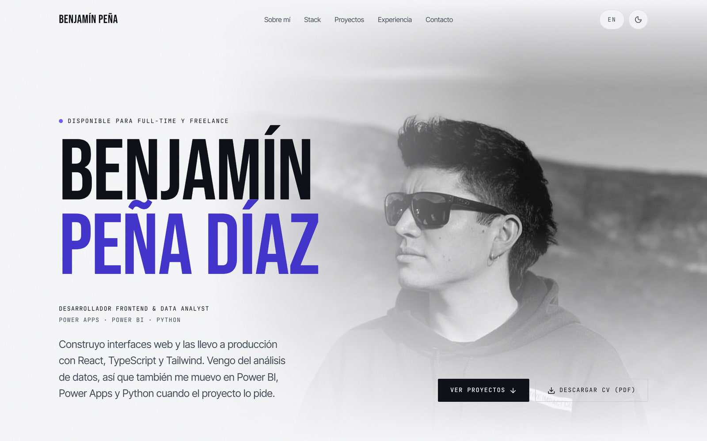
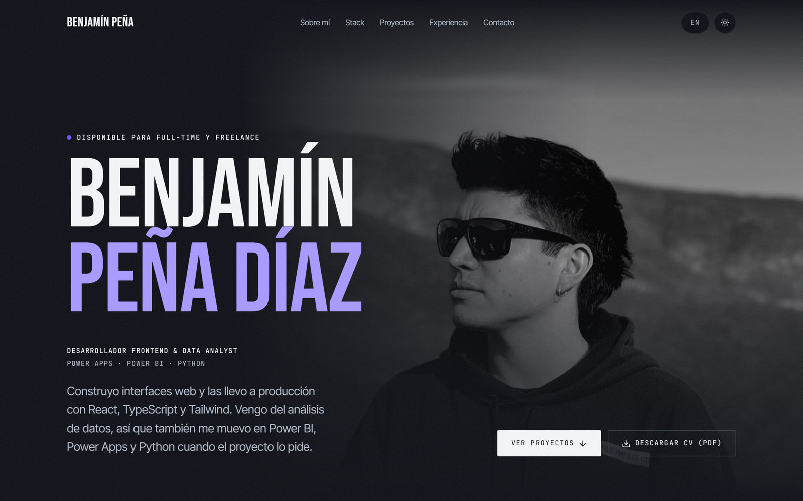
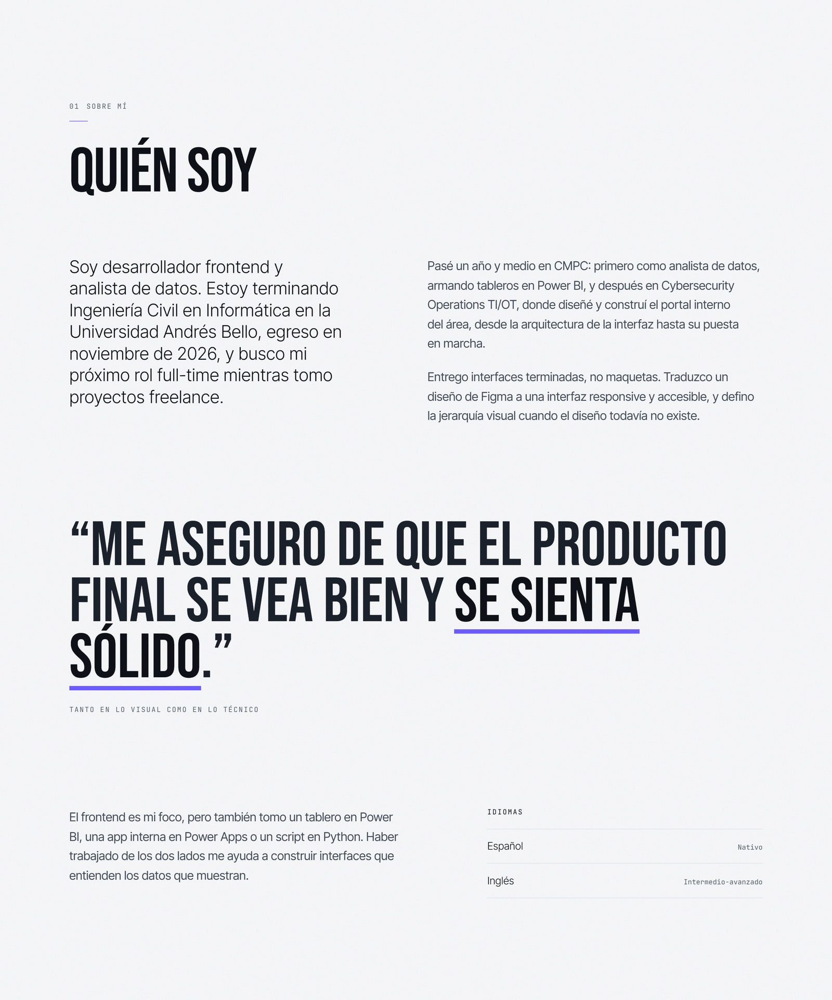
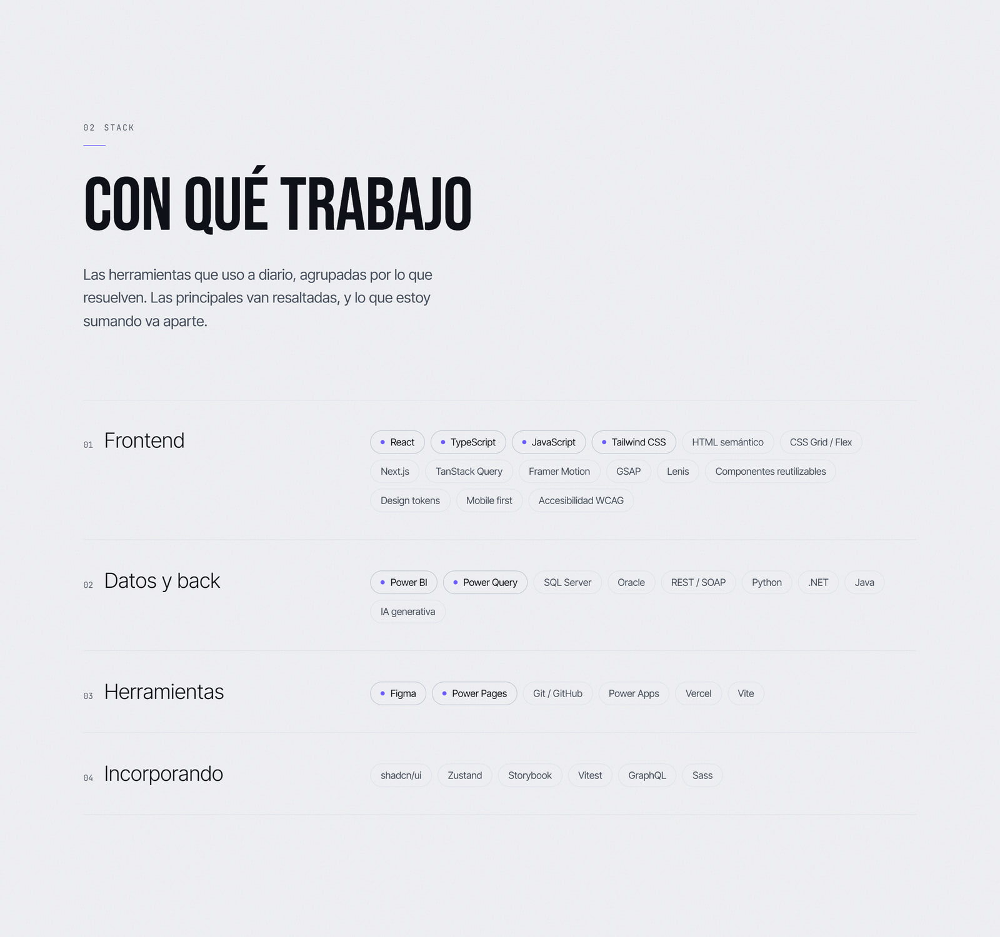
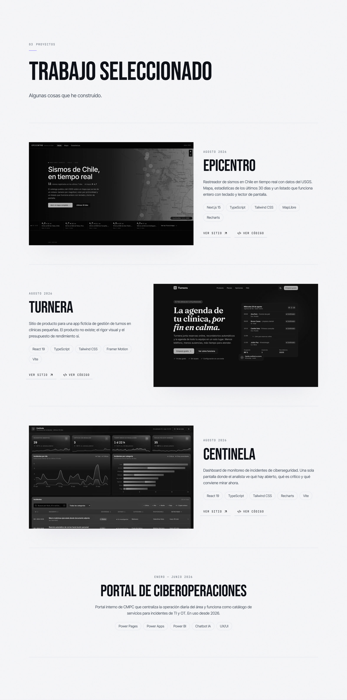
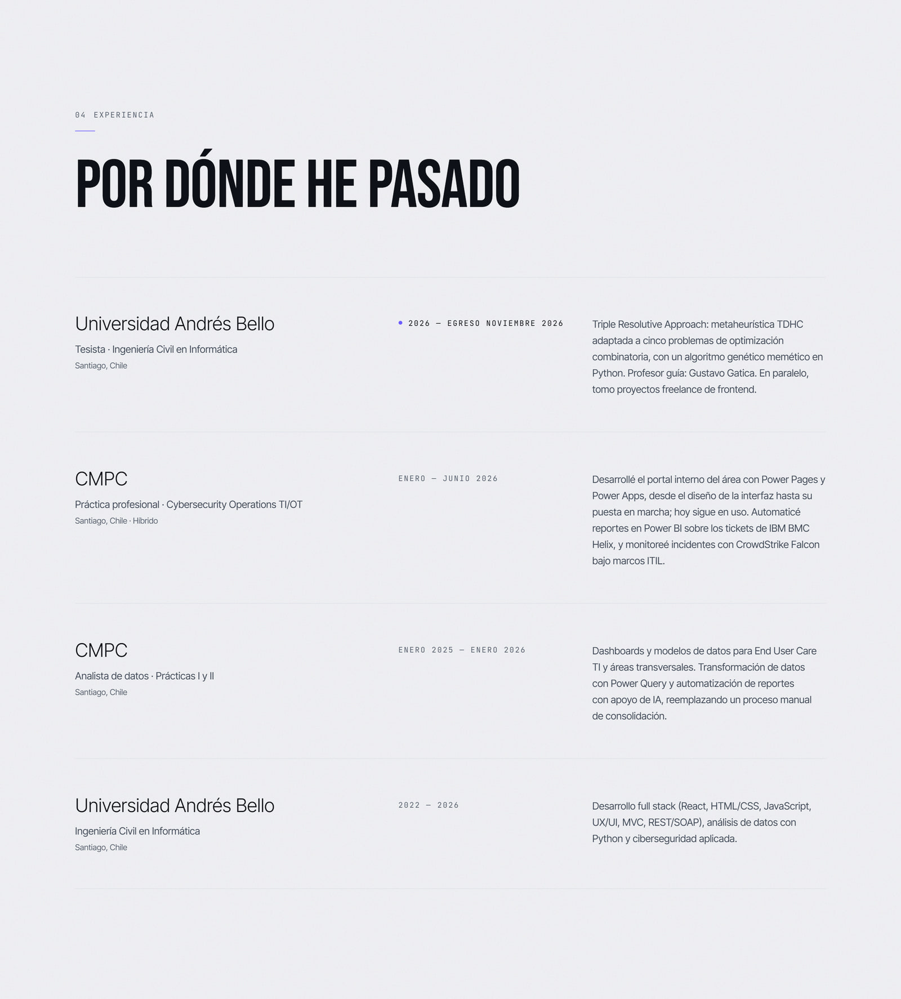
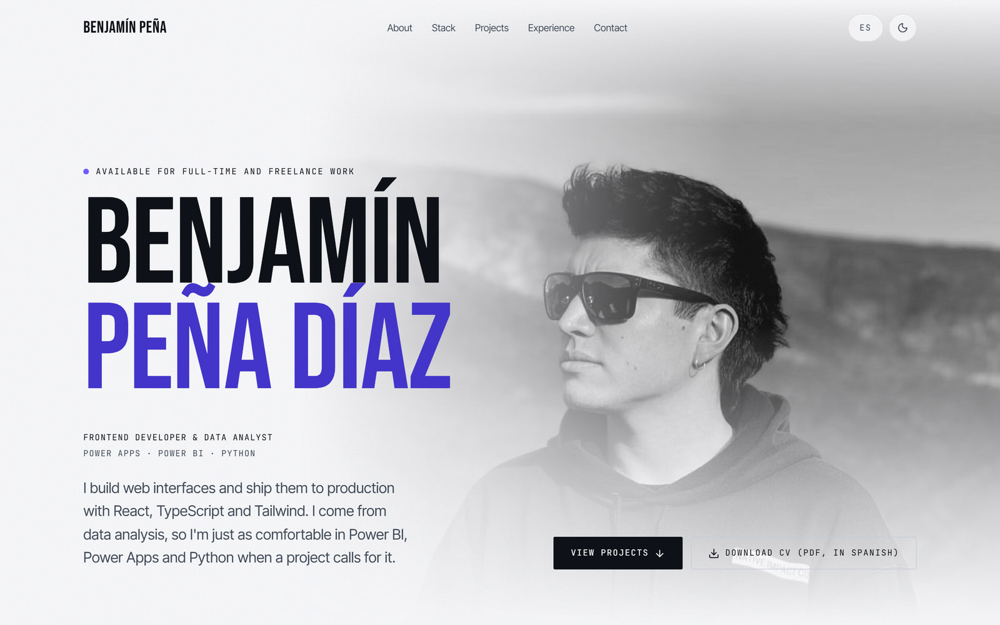
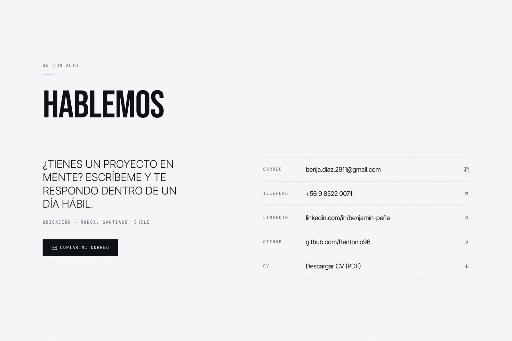
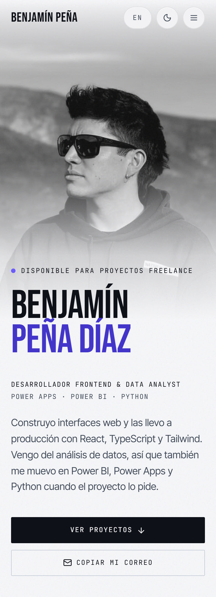
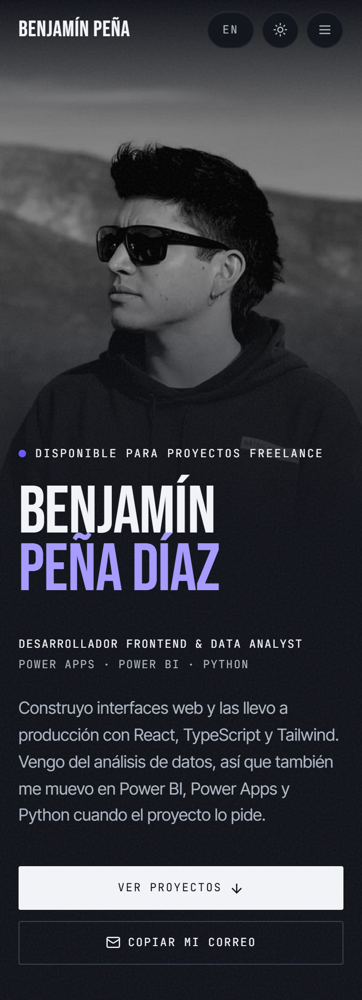

# Portafolio · Benjamín Peña Díaz

Sitio personal de **Benjamín Peña Díaz**, desarrollador frontend en Santiago de Chile.
Español en `/`, inglés en `/en`, modo claro y oscuro, y todo el contenido en archivos de datos tipados.

Paleta tomada del CV, titulares de cartel, scroll suave con Lenis y animaciones 3D con GSAP.

**Accesibilidad:** 0 violaciones de axe-core (WCAG 2.1 AA) en las 9 pantallas auditadas · contraste AA medido sobre píxel real · CLS ≤ 0.0004



---

## Índice

- [Cómo agregar un proyecto](#cómo-agregar-un-proyecto) ← lo que vas a hacer más seguido
- [Puesta en marcha](#puesta-en-marcha)
- [Capturas](#capturas)
- [Stack](#stack)
- [Decisiones de diseño](#decisiones-de-diseño)
- [Decisiones técnicas](#decisiones-técnicas)
- [Estructura](#estructura)
- [Deploy en Vercel](#deploy-en-vercel)
- [Pendientes para Benjamín](#pendientes-para-benjamín)

---

## Cómo agregar un proyecto

Se edita **un solo archivo**: [`src/data/proyectos.ts`](src/data/proyectos.ts).
Nada más. La grilla, las animaciones y los enlaces se ajustan solos.

```ts
{
  slug: "epicentro",                     // identificador único, sin espacios
  nombre: "Epicentro",
  descripcion: {
    es: "Rastreador de sismos en Chile en tiempo casi real con datos del USGS.",
    en: "Near real-time earthquake tracker for Chile using USGS data.",
  },
  tecnologias: ["Next.js 15", "TypeScript", "Tailwind CSS", "MapLibre"],
  fecha: { es: "Agosto 2026", en: "August 2026" },   // mes y año
  demoUrl: "https://epicentro-sigma.vercel.app",         // ← opcional
  repoUrl: "https://github.com/Bentonio96/Epicentro",    // ← opcional
}
```

### Sobre los dos enlaces

`demoUrl` y `repoUrl` son **opcionales a propósito**:

| Situación | Qué se muestra |
|---|---|
| Ambas URLs | Botones **Ver sitio** y **Ver código** |
| Solo `repoUrl` | Solo **Ver código** |
| Solo `demoUrl` | Solo **Ver sitio** |
| Ninguna | Ningún botón, y la tarjeta se cierra limpia sin dejar hueco |

**Nunca se renderiza un enlace roto.** Mientras no tengas una URL, deja la propiedad comentada o bórrala — no pongas `""` ni `"#"`.

El tipo `Proyecto` está en [`src/types/index.ts`](src/types/index.ts), así que si te falta un campo obligatorio TypeScript te avisa antes de compilar.

### Resaltar una tecnología del stack

En [`src/data/stack.ts`](src/data/stack.ts), `principal: true` pone la tecnología a tinta plena y con un punto violeta:

```ts
{ nombre: "React", principal: true },   // tinta plena + punto violeta
{ nombre: "HTML semántico" },           // gris, sin punto
```

Úsalo con moderación: hoy son 8 de 36. El resalte funciona porque es minoría.

Para lectores de pantalla el chip añade "— herramienta principal", porque el criterio WCAG 1.4.1 no permite transmitir información solo con color.

---

## Puesta en marcha

```bash
npm install
```

```bash
npm run dev
```

| Comando | Qué hace |
|---|---|
| `npm run dev` | Servidor de desarrollo en http://localhost:3000 |
| `npm run build` | Build de producción |
| `npm start` | Sirve el build |
| `npm run lint` | ESLint |
| `npm run typecheck` | TypeScript sin emitir |

Regenerar imágenes (foto optimizada, favicons, Open Graph) después de cambiar la foto:

```bash
node scripts/generar-assets.mjs
```

Regenerar las miniaturas de los proyectos capturando sus sitios en vivo:

```bash
node scripts/capturar-proyectos.mjs
```

Regenerar las capturas del README, con el sitio corriendo en `localhost:3001`:

```bash
node scripts/capturar-readme.mjs
```

Verificar el contraste real, con el sitio corriendo en `localhost:3001`:

```bash
node scripts/verificar-contraste.mjs
```

---

## Capturas

| Claro | Oscuro |
|---|---|
|  |  |

**Sobre mí** — biografía breve, cita de cartel que se enciende al leerla e idiomas



**Stack** — filas por categoría; las herramientas principales llevan el punto violeta



**Proyectos** — filas alternas con capturas en 3D; los sistemas internos van como fila de solo texto



**Experiencia** — tabla editorial: dónde y qué, cuándo, detalle



**Inglés** (`/en`) — misma composición, `lang="en"`, hreflang cruzado



**Contacto** — índice de filas pulsables: correo, teléfono, LinkedIn, GitHub y CV



**Móvil** — 390 px, la foto en el flujo para que el nombre no le tape la cara

| Claro | Oscuro |
|---|---|
|  |  |

---

## Stack

- **Next.js 15** con App Router
- **TypeScript** en modo estricto
- **Tailwind CSS v4** — los tokens viven en `@theme`, dentro de `src/app/globals.css`
- **GSAP 3** + **ScrollTrigger** — animaciones ligadas al scroll y efectos 3D
- **Lenis** — scroll suave, sincronizado con el reloj de GSAP
- **lucide-react** para íconos
- **next/font** — Bebas Neue, Inter Tight y JetBrains Mono, autoalojadas
- **next/image** — AVIF y WebP automáticos

GSAP y Lenis se cargan con `import()` diferido, después de hidratar: no entran en el JavaScript inicial (First Load JS 114 kB).

---

## Decisiones de diseño

### Concepto: "Obsidiana"

Inspirado en una plantilla editorial de fotografía: casi todo el impacto sale de la **escala tipográfica** y de la **foto a sangre**, no de efectos. Cuatro reglas sostienen el sistema:

1. **Titulares de cartel.** Una grotesca condensada de un solo peso, en versales, con interlineado por debajo de 1. El nombre del hero llega a 176 px y cada sección abre con su título a ancho completo. En el diccionario se escriben normal y se versalizan con CSS, así que los lectores de pantalla no deletrean.

2. **La marca del CV.** La paleta sale del propio PDF del CV —sus operadores de color, no una captura—: tinta azulada, grises fríos y un único violeta. El sitio y el documento se leen como una sola marca, y el apellido va en violeta en los dos.

3. **Un solo acento, con disciplina.** El violeta aparece en el apellido, el subrayado de la cita, las reglas cortas de cada sección, los puntos de las herramientas principales y del hito actual, el foco y los hover. En ningún otro sitio. En el stack solo 8 de 36 tecnologías llevan el punto.

4. **Foto en blanco y negro, fundida con la página.** Tres velos del color de fondo —arriba, abajo y a la izquierda— la integran en los dos temas, y el nombre entra sobre el lado que no tiene rostro. En móvil la foto va en el flujo y el texto solo pisa su borde inferior.

### Tipografía

| Rol | Fuente | Por qué |
|---|---|---|
| Titulares | **Bebas Neue** 400 | Condensada: a tamaño de cartel pesa, y al ser estrecha el nombre enorme cabe en un teléfono |
| Cuerpo | **Inter Tight** 300/400 | Neutra y estrecha; el 300 da los subtítulos grandes y ligeros de las filas |
| Etiquetas y chips | **JetBrains Mono** 400 | Da el tono técnico de los metadatos sin gritar |

### Color

Todos los pares cumplen **WCAG AA**, calculados sobre los valores exactos y medidos después sobre píxel real:

| Token | Claro | Oscuro | Contraste sobre fondo |
|---|---|---|---|
| Fondo | `#F6F7F9` | `#0E1117` | — |
| Texto | `#0E1117` | `#F1F3F7` | 17.6:1 / 17.0:1 |
| Atenuado | `#414A58` | `#AFB7C4` | 8.4:1 / 9.4:1 |
| Tenue | `#555E6C` | `#8B94A3` | 6.1:1 / 6.2:1 |
| **Acento** (texto) | `#4335C9` | `#A79BFF` | 7.6:1 / 7.9:1 |
| Acento vivo (rellenos) | `#6C5CFF` | `#6C5CFF` | solo decorativo |

El violeta vivo del CV da 4.3:1 sobre claro y 4.2:1 sobre oscuro: por debajo de AA para texto normal. Por eso hay dos tokens de acento, uno para texto y otro para rellenos, en vez de forzar un único violeta que no cumpla en alguno de los dos usos.

Casi todo va recto (radio 0–2 px), como una página impresa. Lo único redondo son las píldoras de tecnología y los controles del encabezado: la forma distingue etiqueta y control de contenido.

---

## Decisiones técnicas

### Un solo idioma por documento, sin librería de i18n

El sitio sirve español en `/` e inglés en `/en`, ambos **prerenderizados estáticos** y ambos indexables, con `hreflang` cruzado y los dos en el sitemap.

La estructura es un único root layout dentro de `src/app/[idioma]/`, que es lo que permite que `<html lang>` sea correcto en cada idioma sin renderizado dinámico. La raíz `/` sirve el español mediante un **rewrite** (no un redirect), así que el enlace del CV queda limpio y sin saltos.

No se usó `next-intl` ni similar: para dos idiomas y un diccionario plano, un `Record<Idioma, string>` tipado hace lo mismo con cero kilobytes de runtime.

### Movimiento: GSAP y Lenis en un solo componente

Todo lo que se mueve con el scroll vive en [`src/components/Movimiento.tsx`](src/components/Movimiento.tsx):

- **Scroll suave** con Lenis, movido por el `ticker` de GSAP. Un único `requestAnimationFrame` para los dos: con uno cada uno, ScrollTrigger lee posiciones con un fotograma de retraso y los efectos atados al scroll tiemblan. Las anclas del menú usan el mismo scroll suave; el enlace para saltar al contenido se deja nativo, porque debe mover el foco del teclado y un scroll programático no lo mueve.
- **Titulares de sección** cuyas palabras giran en 3D al entrar, cada una con su propio punto de fuga.
- **Hero con profundidad**: al salir, la foto baja más lenta que la página y el texto sube más rápido.
- **Cita** cuyas palabras pasan de gris a su color al ritmo de la lectura: una custom property `--p` que GSAP lleva de 0 a 1, con los dos extremos dentro de AA.
- **Capturas de proyecto en 3D**: llegan tumbadas hacia atrás y giradas hacia el texto, y se enderezan al subir; con ratón, además se inclinan hacia el cursor con un brillo que lo sigue. Son tres capas —perspectiva, giro de scroll, giro de puntero— porque cada una tiene su propio dueño del `transform`.
- **Reglas capilares que se dibujan** de izquierda a derecha al entrar, y **subrayado de la cita** que se traza con el scroll, línea por línea. Son fondos de 1 px movidos por una custom property `--trazo` y no bordes: un borde no se puede dibujar a medias.
- **Filas que entran escalonadas**: en proyectos (fecha, nombre, descripción, tecnologías, enlaces), en experiencia (dónde, cuándo, qué) y en contacto, desde la izquierda.

Cuatro reglas que conviene no deshacer:

1. **Carga diferida.** GSAP, ScrollTrigger y Lenis entran con `import()` dentro del efecto: no compiten con la foto del hero, que es el LCP. Por eso la única animación de carga —las letras del nombre girando en 3D— es CSS: esperar a GSAP dejaría ver el nombre quieto y luego saltar.
2. **Nada anima la opacidad.** Solo desplazamientos, giros y escalas. Con `opacity: 0` en lo que espera al scroll, las auditorías lo leen como texto sin contraste (la primera versión del sitio marcaba 35 nodos en Lighthouse por eso).
3. **Todo dentro de `gsap.matchMedia`** con `prefers-reduced-motion: no-preference`. Si el sistema pide menos movimiento no se crea ni Lenis ni una animación; sin JavaScript, igual. No hay ningún estado oculto que haya que desbloquear.
4. **GSAP no toca la estructura del DOM.** Las palabras y letras se parten en el servidor; el cliente solo escribe transformaciones en línea, que React no gestiona y no pisa al re-renderizar.

Un tropiezo que quedó comentado en el código: `gsap.quickTo` necesita el nombre canónico de la propiedad (`rotationX`), no el alias `rotateX`. Con el alias crea el tween, pero cada actualización busca una propiedad que no existe y la capa nunca se mueve, sin ningún error.

### Las letras del nombre y el CLS

Partir el nombre en letras para girarlas en 3D subió el CLS de 0.002 a **0.03**. Cada letra es su propia caja, la fuente de respaldo es más ancha que Bebas Neue, y al llegar la real todas se recolocaban de golpe, hasta 130 px.

Un script de `<head>` ([`src/lib/fuentes.ts`](src/lib/fuentes.ts)) retiene la entrada hasta que carga la condensada, con un tope de 2 s. Dejar las letras de canto no bastaba: giradas conservan una caja de unos píxeles de alto y Chrome las sigue contando. Ocultas con `visibility` no cuentan, y el nombre accesible vive en su propio span, que no se oculta. Resultado: **CLS ≤ 0.0004**, por debajo del de antes del rediseño.

### El contraste sobre una foto

[`scripts/verificar-contraste.mjs`](scripts/verificar-contraste.mjs) mide contra los píxeles realmente renderizados, porque axe calcula el fondo recorriendo ancestros y no ve capas fijas ni imágenes detrás del texto.

La primera versión muestreaba un píxel justo encima de cada texto, y con la foto del hero dejó de servir por dos lados: un punto no representa un fondo que cambia a lo largo de la línea, y con titulares a 0.86 de interlineado las letras sobresalen de su caja, así que el píxel "de encima" era la propia letra. Ahora el script **oculta todo el texto**, captura, y muestrea una rejilla de puntos sobre las **cajas de línea reales** (`Range.getClientRects`, no la caja del elemento: un span en bloque mide todo el ancho y muestrearía fondo que ninguna letra toca). Aplica 3:1 al texto grande y 4.5:1 al resto, en claro y oscuro, a 1440 y 390 px.

Peor caso actual:

| | Escritorio | Móvil |
|---|---|---|
| Claro | 4.84:1 | 4.85:1 |
| Oscuro | 5.34:1 | 5.41:1 |

### El grano

Sobre el fondo va una capa de **grano**: un SVG de 300×300 con `feTurbulence`, embebido y repetido, al 7 % de opacidad (7.5 % en oscuro). Sobre una tinta casi plana es lo que la hace leerse como papel y no como pantalla apagada. La foto del hero tapa esa capa fija, así que repite el grano encima: sin eso, el borde de la foto se veía como un corte entre ruido y liso.

### Otras interacciones

- **Cruce entre Stack y Proyectos.** Apuntar una tecnología del stack enmarca en violeta las capturas de los proyectos que la usan; apuntar o **enfocar** un proyecto resalta sus tecnologías. El resalte suma en vez de atenuar el resto, que bajaría el contraste.
- **Capturas en grises** que recuperan el color al apuntar la fila, solo con puntero fino: en un teléfono no hay hover y dejarlas grises escondería lo que se viene a ver. Las genera [`scripts/capturar-proyectos.mjs`](scripts/capturar-proyectos.mjs) desde cada demo en producción.
- **Transición de tema.** El tema nuevo se abre en círculo desde el botón, con la View Transitions API.
- **Barrido en los botones.** Al apuntar, el color del botón entra de izquierda a derecha y el texto pasa al color contrario; al salir, se va por la derecha. Es CSS puro (`.boton-barrido`) y va fuera de `@layer`: las utilidades de Tailwind viven en una capa que le gana a `components` sin importar la especificidad.
- **El correo copia en escritorio.** Un `mailto:` sin app de correo configurada —lo normal en Windows— abre una pestaña en blanco. Con ratón, la fila de correo copia la dirección y avisa; en el teléfono sigue abriendo la app de correo. El icono y el texto para lectores de pantalla cambian con la misma media query (`pointer: fine`).

### Rendimiento

Qué movió la aguja, medido y no supuesto:

- **CLS 0.168 → 0.019.** La fila de CTAs del hero medía 96 px con la fuente de respaldo (envuelta en dos líneas) y colapsaba a 43 px al cargar la monoespaciada, arrastrando todo lo de abajo. Se apilan a ancho completo en móvil: altura determinista.
- **CLS 0.032 → 0.000 en móvil**, cambiando el respaldo de la monoespaciada. `next/font` lo genera solo, y para JetBrains Mono eligió `local("Arial")` con `size-adjust: 134.59%`: Arial es proporcional y estirarla deja cada carácter casi un 30 % más ancho que la fuente real. Con `adjustFontFallback: false` y monoespaciadas de verdad como respaldo, los bloques miden igual con una fuente y con la otra.
- **CLS 0.03 → 0.0004** con las letras 3D del nombre (ver arriba).
- **GSAP y Lenis fuera de la ruta crítica** con `import()` diferido.
- **axe: 0 violaciones** en 9 pantallas (español e inglés, claro y oscuro, escritorio y móvil, y el 404), con las animaciones activas.

### Tema claro/oscuro

Script bloqueante en `<head>` que lee `localStorage` antes del primer pintado, así que no hay destello de tema equivocado. Si el almacenamiento está bloqueado (modo privado), el tema igual cambia, solo que no persiste.

El tema vive en un atributo `data-tema` sobre `<html>`, no en una clase, y **el switch de idioma es un `<a>` y no un `<Link>`**. Las dos cosas resuelven el mismo problema: React es dueño del elemento raíz, y al navegar entre `/` y `/en` cambia el segmento `[idioma]`, re-renderiza el root layout y al reconciliar `<html>` descarta lo que no está en sus props. Con navegación blanda eso borraba el tema que el script había dejado puesto en runtime: entrabas en oscuro, cambiabas a inglés y salías en claro. Con una carga completa el script vuelve a ejecutarse antes de pintar, así que el tema sobrevive y sin destello — y para un cambio de idioma, que además cambia el `lang` del documento, recargar es lo correcto.

### Accesibilidad

Auditado con axe-core sobre las reglas WCAG 2.1 A/AA + best-practices, en 9 pantallas (español e inglés, claro y oscuro, escritorio y móvil, y el 404): **0 violaciones**.

- Skip link como primer elemento enfocable
- Foco visible de 2 px en todo el sitio, nunca eliminado
- `aria-expanded` / `aria-controls` en el menú móvil, cierre con `Escape` y foco que vuelve al botón
- El menú móvil se desmonta al cerrar: no queda en el orden de tabulación
- Alt descriptivo en la foto, íconos decorativos con `aria-hidden`
- Enlaces externos avisan "(se abre en una pestaña nueva)" a lectores de pantalla
- `prefers-reduced-motion` respetado globalmente y en cada animación

### El 404 lleva estilos embebidos

Es la única rareza del proyecto y es deliberada. Con el root layout dentro del segmento dinámico `[idioma]` (necesario para que `lang` sea correcto en ambos idiomas), Next renderiza la página de *not-found* fuera del layout: no le adjunta la hoja de Tailwind ni el `<html lang>`. Antes que degradar el `lang` de todo el sitio inglés para arreglar una página que casi nadie ve, esa página se basta sola: lleva sus estilos embebidos y fija el idioma con una línea de script. Los lectores de pantalla leen el DOM ya ejecutado, así que para ellos queda correcto, y la página es `noindex`. Todo está comentado en el archivo.

---

## Estructura

```
src/
├─ app/
│  ├─ [idioma]/
│  │  ├─ layout.tsx        root layout: <html lang>, fuentes, tema
│  │  ├─ page.tsx          /es y /en, prerenderizadas
│  │  └─ not-found.tsx     404 con estilos propios
│  ├─ globals.css          ← EL SISTEMA DE DISEÑO (tokens en @theme)
│  ├─ sitemap.ts · robots.ts
│
├─ components/
│  ├─ Pagina.tsx           composición única, compartida por ambos idiomas
│  ├─ LayoutRaiz.tsx       cascarón <html>/<body>
│  ├─ Movimiento.tsx       Lenis + GSAP: todo lo que se mueve con el scroll
│  ├─ layout/              Encabezado · PieDePagina · BotonTema · BotonIdioma · SaltarAlContenido
│  ├─ sections/            Hero · SobreMi · Stack · Proyectos · Experiencia · Contacto
│  └─ ui/                  Seccion · TarjetaProyecto · Boton · Chip · Reveal (marca [data-revelar])
│
├─ data/
│  ├─ proyectos.ts         ← el archivo que vas a editar
│  ├─ perfil.ts            datos personales y SEO
│  ├─ stack.ts · experiencia.ts
│
├─ i18n/                   config.ts · diccionario.ts (todo el texto de interfaz)
├─ lib/                    fuentes · metadata · tema · blur · utils
└─ types/                  Proyecto · CategoriaStack · Hito · Idioma
```

Para cambiar la paleta, la tipografía o el espaciado: **`src/app/globals.css`**, bloque `@theme`. Un valor ahí se propaga a todo el sitio.

Para cambiar textos de interfaz: **`src/i18n/diccionario.ts`**, en ambos idiomas.

El CV en PDF vive en `public/CV-Benjamin-Pena.pdf` y se enlaza desde el hero y desde Contacto con el atributo `download`, y se guarda como `CV-Benjamín-Peña.pdf` (el nombre está en `perfil.cvArchivo` y en la cabecera `Content-Disposition` de `next.config.ts`; si cambias uno, cambia el otro). La ruta está en `perfil.cv`, dentro de [`src/data/perfil.ts`](src/data/perfil.ts), junto con los idiomas.

---

## Deploy en Vercel

1. Importa el repositorio en Vercel.
2. Deploy. **No hay que configurar nada.**

El [`vercel.json`](vercel.json) declara `"framework": "nextjs"` de forma explícita, para no depender de la autodetección. Se usa `vercel.json` y no `vercel.ts` a propósito: este último necesita instalar `@vercel/config`, y no vale la pena sumar una dependencia por tres líneas de configuración.

Todo el sitio es estático: no hay funciones de servidor ni base de datos.

### Si el deploy devuelve 404

Síntoma: `/og-es.png` y `/favicon.ico` cargan, pero `/`, `/es`, `/en`, `/robots.txt` y `/sitemap.xml` dan 404 de Vercel (`X-Vercel-Error: NOT_FOUND`).

Significa que el proyecto quedó con el preset **"Other"** en vez de Next.js: en ese modo Vercel publica la carpeta `public/` tal cual y descarta la aplicación. Se arregla en **Settings → Build and Deployment**:

- **Framework Preset:** `Next.js`
- **Build Command / Output Directory / Install Command:** con el override **apagado**, usando los valores por defecto
- **Root Directory:** vacío

Después, **Deployments → ⋯ → Redeploy**. Un diagnóstico rápido para distinguirlo:

```bash
curl -s -o /dev/null -w "%{http_code}
" https://TU-DOMINIO.vercel.app/sitemap.xml
```

`200` es que la app está desplegada; `404` con `/favicon.ico` en `200` es este caso.

### De dónde sale la URL del sitio

Las canónicas, el `hreflang`, el sitemap, las imágenes de Open Graph y los datos estructurados necesitan la URL absoluta del sitio. Se resuelve sola en [`src/data/perfil.ts`](src/data/perfil.ts), en este orden:

| Orden | Variable | De dónde viene |
|---|---|---|
| 1 | `NEXT_PUBLIC_SITIO_URL` | Tuya. Defínela **solo si tienes dominio propio**, con protocolo |
| 2 | `VERCEL_PROJECT_PRODUCTION_URL` | La inyecta Vercel. Dominio de producción, estable entre despliegues |
| 3 | `VERCEL_URL` | La inyecta Vercel. Única por despliegue: los previews se apuntan a sí mismos |
| 4 | `http://localhost:3000` | Desarrollo local |

Gracias al punto 2, un deploy en Vercel queda correcto sin tocar nada. `NEXT_PUBLIC_SITIO_URL` es una variable **de este proyecto**, no de Vercel, y solo hace falta el día que apuntes un dominio propio:

```bash
vercel env add NEXT_PUBLIC_SITIO_URL production
```

Ver también [`.env.example`](.env.example).

---

## Pendientes para Benjamín

- [ ] **Revisar la cuarta tarjeta.** El "Portal de Ciberoperaciones" lo saqué de tu CV: es trabajo interno de CMPC, así que no tiene demo ni repo y la tarjeta se renderiza sin botones. Si prefieres dejar solo los tres proyectos públicos, borra ese bloque de [`src/data/proyectos.ts`](src/data/proyectos.ts).
- [ ] **Actualizar el CV** en `public/CV-Benjamin-Pena.pdf` cuando cambie. El botón de descarga en Contacto apunta a ese archivo.
- [ ] Solo si algún día compras un dominio propio: definir `NEXT_PUBLIC_SITIO_URL` (ver [Deploy en Vercel](#deploy-en-vercel)).

---

Hecho en Santiago de Chile.
